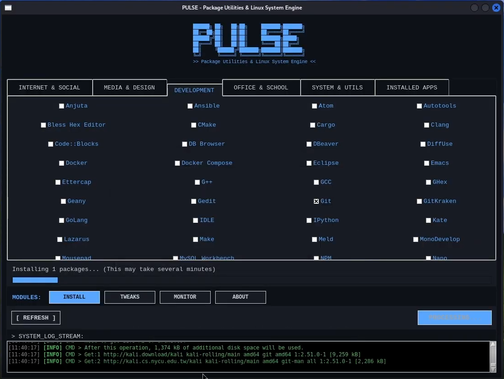
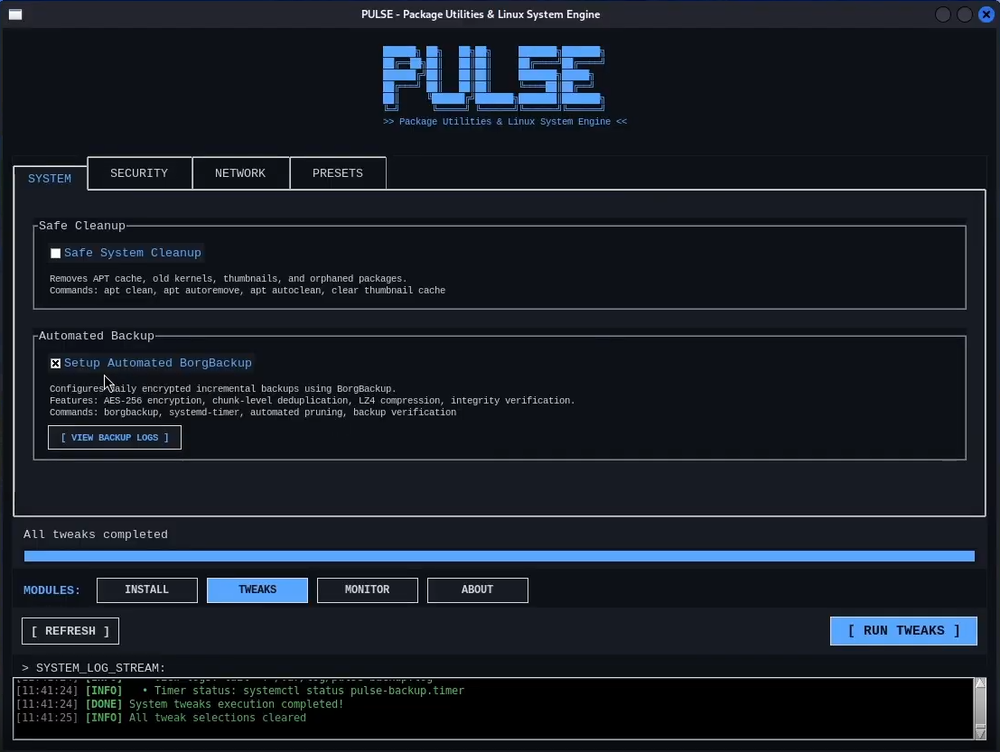
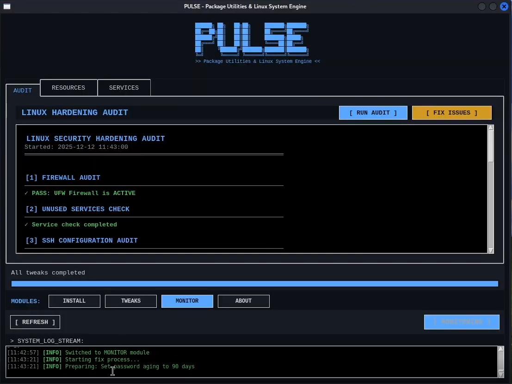
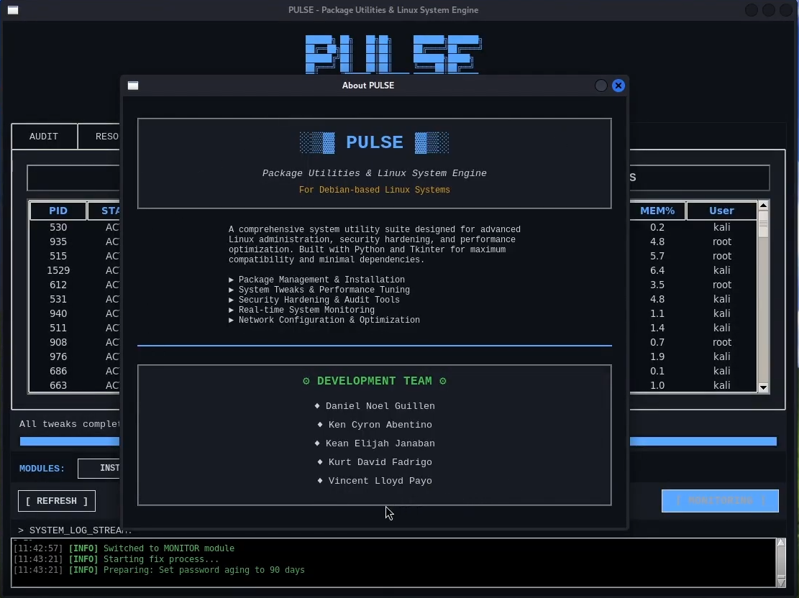

<div align="center">

# PULSE

### *Package Utilities & Linux System Engine*

<p>
   <a href="https://github.com/danielnoelle/Pulse">
      
   </a>
   <a href="LICENSE">
      
   </a>
   <a href="https://www.instagram.com/_noweliih/">
      
   </a>
</p>



</div>

---

## ✨ Features

<table>
<tr>
<td width="50%">

**📦 Intelligent Package Management**  
Browse 200+ categorized applications with batch install/remove, automatic dependency resolution, and external .deb support

**🔐 Security Hardening Toolkit**  
One-click UFW firewall, SSH hardening, fail2ban, automatic updates, and CIS-based security audits

</td>
<td width="50%">

**💾 Enterprise Backup Engine**  
BorgBackup with AES-256 encryption, chunk-level deduplication, and automated daily backups with pruning

**📊 Real-Time Monitoring**  
Live CPU, GPU, RAM, disk, and network tracking with service and process management

</td>
</tr>
</table>

---

## 🚀 Quick Start

**Install Dependencies**

```bash
sudo apt update
sudo apt install -y python3 python3-tk python3-apt policykit-1
```

**Clone and Run**

```bash
git clone https://github.com/danielnoelle/Pulse.git
cd Pulse
chmod +x pulse.py
python3 pulse.py
```

---

## 💡 Configuration Tips

| Feature | Description |
|---------|-------------|
| **🗄️ Settings** | User preferences saved in `~/.config/pulse/settings.json` |
| **📝 Logs** | Application logs stored in `~/.local/share/pulse/pulse.log` |
| **📦 Custom Apps** | Add your own applications in `config.py` |
| **🔑 Backup Key** | Store your BorgBackup passphrase securely — no recovery option! |
| **🐛 Debug** | Run `python3 -B pulse.py` from terminal for verbose output |

---

## 📋 Core Capabilities

### Smart Package Management

Install, update, and remove packages with an intuitive graphical interface and powerful batch operations.

```
✓ Browse by category (Internet, Dev, Media, etc.)
✓ Dynamic tooltips with package descriptions
✓ External .deb file installation
✓ Automatic dependency resolution
```

### Enterprise Backup System

Protect your data with encrypted, deduplicated, and compressed backups powered by BorgBackup.

```
✓ AES-256-CTR + HMAC-SHA256 encryption
✓ 50-90% storage savings via deduplication
✓ LZ4/ZSTD compression
✓ Automated daily backups at 2:00 AM
```

### Security Hardening & Audits

Harden your system with automated security configurations and CIS-based vulnerability assessments.

```
✓ UFW firewall with secure defaults
✓ SSH hardening (port change, key-only auth)
✓ Privilege escalation protection
✓ Auto-fix for detected vulnerabilities
```

### Resource Monitoring

Real-time system monitoring with interactive dashboards and process management.

```
✓ Live CPU, GPU, RAM, and disk usage
✓ Network I/O tracking (upload/download)
✓ Service management (start/stop/restart)
✓ Process control with priority adjustment
```

---

## 🖼️ Screenshots

<div align="center">
<table>
<tr>
<td width="50%">

<p align="center"><em>Package Installation Interface</em></p>
</td>
<td width="50%">

<p align="center"><em>System Tweaks & Backup</em></p>
</td>
</tr>
<tr>
<td width="50%">

<p align="center"><em>Real-Time Resource Monitor</em></p>
</td>
<td width="50%">

<p align="center"><em>About & Credits</em></p>
</td>
</tr>
</table>
</div>

<br>

## 🛠️ Technology Stack

- **Language:** Python 3
- **UI Framework:** Tkinter
- **Package Manager:** python3-apt / APT
- **Backup Engine:** BorgBackup
- **Authentication:** PolicyKit (pkexec)
- **Architecture:** Modular MVC Pattern

## 📋 System Requirements

| Requirement | Details |
|-------------|---------|
| **OS** | Debian-based Linux (Ubuntu 20.04+, Debian 11+, Linux Mint 20+) |
| **Python** | 3.8 or higher |
| **RAM** | 2GB minimum (4GB recommended) |
| **Tools** | apt-get, pkexec, systemctl, python3-tk |

## 📝 License

This project is licensed under the **MIT License** — feel free to use, modify, and contribute.  
See [LICENSE](LICENSE) for full details.

---

<div align="center">

**Built with ❤️ by [danii](https://github.com/danielnoelle) and team**

⭐ Star this repository if you find it helpful!

</div>
